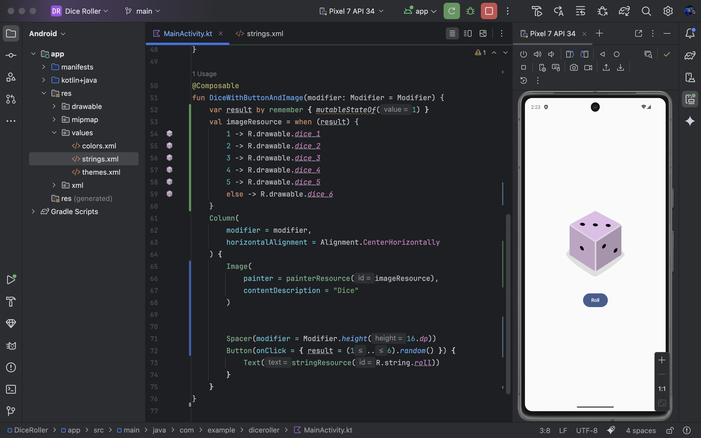

name: Dice Roller App

description: >
  🎲 一個使用 Kotlin + Jetpack Compose 開發的簡單骰子 App。
  點擊按鈕即可擲骰子，螢幕會隨機顯示 1~6 的骰子圖片。

features:
  - 顯示一顆骰子圖片 (1~6)
  - 按下 Roll 按鈕後，隨機產生一個點數並更新圖片
  - 使用 Jetpack Compose 架構，UI 即時更新

tech_stack:
  - Kotlin
  - Jetpack Compose
  - Material 3 (M3)
  - State 管理 (remember { mutableStateOf() })
  - Composable 函式化 UI

project_structure: |
  app/src/main/java/com/example/diceroller/
  │
  ├── MainActivity.kt        # App 入口
  ├── DiceRollerApp()        # 預覽用 Composable
  └── DiceWithButtonAndImage # 骰子顯示 + 按鈕邏輯

screenshots:
  - 初始畫面：顯示骰子 1
  - 點擊按鈕後：隨機更新為 1~6
  - 可在 res/drawable/ 放置 dice_1.png ~ dice_6.png

usage:
  - step: Clone 專案到本地端
    command: git clone https://github.com/你的帳號/diceroller.git
  - step: 用 Android Studio 開啟
  - step: 點擊執行，選擇模擬器或實體裝置

code_highlight: |
  var result by remember { mutableStateOf(1) }

  Button(onClick = { result = (1..6).random() }) {
      Text(stringResource(R.string.roll))
  }
  👉 透過 mutableStateOf 管理骰子數字，UI 會在狀態變化時自動刷新。

future_improvements:
  - 加入擲骰子的動畫效果
  - 支援同時擲多顆骰子
  - 顯示骰子點數文字
